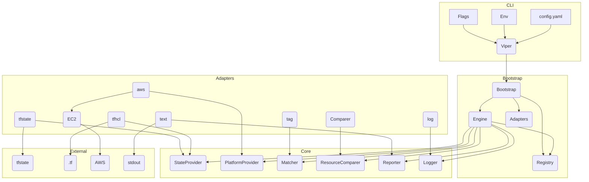

# 🔍 Infrastructure Drift Detector (Infra-Drift-Detector)

[](https://goreportcard.com/report/github.com/olusolaa/infra-drift-detector)
[](https://opensource.org/licenses/MIT)

## 🗂️ Table of Contents
- [📖 Overview](#-overview)
- [🚀 Features](#-features)
- [📁 Project Structure](#-project-structure)
- [🏗️ Architecture](#-architecture)
- [💾 Installation](#-installation)
  - [🧰 Prerequisites](#-prerequisites)
  - [🛠️ Build from Source](#-build-from-source)
  - [📦 Using `go install`](#-using-go-install)
- [⚙️ Configuration](#-configuration)
- [🖥️ Usage](#-usage)
  - [🔖 Flags](#-flags)
  - [💡 Example Execution](#-example-execution)
- [⚖️ Design Decisions & Trade-offs](#-design-decisions--trade-offs)
- [🧪 Testing](#-testing)
- [🌱 Future Improvements](#-future-improvements)
- [🤝 Contributing](#-contributing)
- [📝 License](#-license)

## 📖 Overview
Infra-Drift-Detector is a command-line tool written in Go to detect configuration drift in cloud infrastructure. It compares the desired state defined in an Infrastructure-as-Code (IaC) source against the actual state observed on the cloud provider.

Currently supported  
* **Desired State:** Terraform state file (`.tfstate`)  
* **Actual State:** AWS (EC2 instances)  
* **Matching:** Tag-based  

## 🚀 Features
* Compares desired state with actual state.
* Detects drift on configurable attributes.
* Concurrent analysis for performance.
* Reports drift, missing resources, unmanaged resources.
* Configurable via YAML, env vars, CLI flags.
* Hexagonal architecture for easy extension.
* Structured logging and colored output.

## 📁 Project Structure
```text
drift-analyser/
├── cmd/
│   └── driftanalyser/
│       ├── main.go
│       └── cmd/
│           └── root.go
├── internal/
│   ├── app/
│   │   └── bootstrap.go
│   ├── core/
│   │   ├── domain/
│   │   │   ├── resource.go
│   │   │   ├── result_types.go
│   │   │   ├── kinds.go
│   │   │   └── keys.go
│   │   ├── ports/
│   │   │   └── …
│   │   └── service/
│   │       ├── engine.go
│   │       └── registry.go
│   ├── adapters/
│   │   ├── platform/
│   │   │   └── aws/
│   │   │       ├── provider.go
│   │   │       ├── handler.go
│   │   │       └── ec2/
│   │   │           ├── handler.go
│   │   │           ├── mapper.go
│   │   │           └── filter_builder.go
│   │   ├── state/
│   │   │   ├── tfstate/
│   │   │   │   ├── provider.go
│   │   │   │   ├── parser.go
│   │   │   │   ├── mapper.go
│   │   │   │   └── mappings.go
│   │   │   └── tfhcl/
│   │   │       ├── provider.go
│   │   │       ├── parser.go
│   │   │       └── mapper.go
│   │   └── matching/
│   │       └── tag/
│   │           └── matcher.go
│   ├── resources/
│   │   └── compute/
│   │       └── instance_comparer.go
│   ├── reporting/
│   │   └── text/
│   │       └── reporter.go
│   ├── errors/
│   │   ├── errors.go
│   │   └── codes.go
│   ├── log/
│   │   ├── log.go
│   │   └── config.go
│   ├── config/
│   │   └── config.go
│   └── util/
│       └── cli_overrides.go
├── configs/
│   └── config.yaml
├── examples/
│   ├── main.tf
│   └── terraform.tfstate
├── test/
│   └── mocks/
├── go.mod
├── go.sum
└── Makefile
```

## 🏗️ Architecture
This project follows Hexagonal Architecture (Ports & Adapters) for decoupling and testability.



## 💾 Installation

### 🧰 Prerequisites
* Go 1.19+
* AWS credentials (default chain)
* Terraform state file (or other desired state source)

### 🛠️ Build from Source
```bash
git clone https://github.com/olusolaa/infra-drift-detector.git
cd infra-drift-detector
go build -o drift-analyser ./cmd/driftanalyser
```

### 📦 Using `go install`
```bash
go install github.com/olusolaa/infra-drift-detector/cmd/driftanalyser@latest
```

## ⚙️ Configuration
Priority order: flags → env vars (`DRIFT_` prefix) → config file → defaults.  
Key sections: `settings`, `state`, `platform`, `resources`.

## 🖥️ Usage
```bash
./drift-analyser [flags]
```

### 🔖 Flags
| Flag | Description |
|------|-------------|
| `-c, --config FILE` | Config file path |
| `--log-level LEVEL` | `debug`, `info`, `warn`, `error` |
| `--log-format FORMAT` | `text`, `json` |
| `--attributes LIST` | Per-kind attribute overrides |
| `-h, --help` | Help |

### 💡 Example Execution
```bash
./drift-analyser -c ./configs/config.yaml

export DRIFT_SETTINGS_LOG_LEVEL=debug
./drift-analyser -c ./configs/config.yaml --attributes "ComputeInstance=instance_type,tags"

./drift-analyser
```

## ⚖️ Design Decisions & Trade-offs
* Hexagonal architecture for extensibility
* Accurate `tfstate` adapter vs. demo-only `tfhcl`
* AWS SDK v2 with Strategy pattern for handlers
* Custom comparison logic for complex types
* Viper + Cobra for config and CLI
* Structured error and logging packages
* Concurrency via channels, goroutines, `errgroup`

## 🧪 Testing
Unit tests (`*_test.go`) and planned integration tests under `test/`.

```bash
go test ./...
go test ./... -coverprofile=coverage.out && go tool cover -html=coverage.out
```

## 🌱 Future Improvements
* More resource types (S3, RDS, …)
* GCP & Azure providers
* Pulumi and enhanced HCL sources
* Explicit mapping matcher
* JSON reporter
* Remote state back-ends
* Remediation suggestions
* Full integration tests

## 🤝 Contributing
Contributions welcome! Open an issue to discuss changes and ensure tests pass before PRs.

## 📝 License
MIT License
```