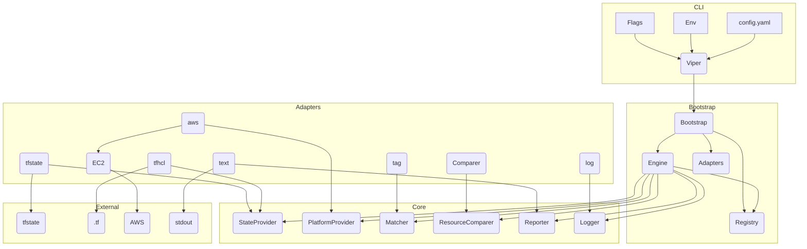

# 🔍 Infrastructure Drift Detector (Infra-Drift-Detector)

[](https://goreportcard.com/report/github.com/olusolaa/infra-drift-detector)
[](https://opensource.org/licenses/MIT)

## 🗂️ Table of Contents
- [📖 Overview](#-overview)
- [🚀 Features](#-features)
- [📁 Project Structure](#-project-structure)
- [🏗️ Architecture](#-architecture)
- [💾 Installation](#-installation)
  - [🧰 Prerequisites](#-prerequisites)
  - [🛠️ Build from Source](#-build-from-source)
  - [📦 Using `go install`](#-using-go-install)
- [⚙️ Configuration](#-configuration)
- [🖥️ Usage](#-usage)
  - [🔖 Flags](#-flags)
  - [💡 Example Execution](#-example-execution)
  - [🧪 Running the Demo](#-running-the-demo)
- [⚖️ Design Decisions & Trade-offs](#-design-decisions--trade-offs)
- [🧪 Testing](#-testing)
- [🌱 Future Improvements](#-future-improvements)
- [🤝 Contributing](#-contributing)
- [📝 License](#-license)
- [🧪 Drift Detection in Action](#-drift-detection-in-action)

## 📖 Overview
Infra-Drift-Detector is a command-line tool written in Go to detect configuration drift in cloud infrastructure. It compares the desired state defined in an Infrastructure-as-Code (IaC) source against the actual state observed on the cloud provider.

Currently supported  
* **Desired State:** Terraform state file (`.tfstate`)  
* **Actual State:** AWS (EC2 instances)  
* **Matching:** Tag-based  

## 🚀 Features
* Compares desired state with actual state.
* Detects drift on configurable attributes.
* Concurrent analysis for performance.
* Reports drift, missing resources, unmanaged resources.
* Configurable via YAML, env vars, CLI flags.
* Hexagonal architecture for easy extension.
* Structured logging and colored output.

## 📁 Project Structure
```text
drift-analyser/
├── cmd/
│   └── driftanalyser/
│       ├── main.go
│       └── cmd/
│           └── root.go
├── internal/
│   ├── app/
│   │   └── bootstrap.go
│   ├── core/
│   │   ├── domain/
│   │   │   ├── resource.go
│   │   │   ├── result_types.go
│   │   │   ├── kinds.go
│   │   │   └── keys.go
│   │   ├── ports/
│   │   │   └── …
│   │   └── service/
│   │       ├── engine.go
│   │       └── registry.go
│   ├── adapters/
│   │   ├── platform/
│   │   │   └── aws/
│   │   │       ├── provider.go
│   │   │       ├── handler.go
│   │   │       └── ec2/
│   │   │           ├── handler.go
│   │   │           ├── mapper.go
│   │   │           └── filter_builder.go
│   │   ├── state/
│   │   │   ├── tfstate/
│   │   │   │   ├── provider.go
│   │   │   │   ├── parser.go
│   │   │   │   ├── mapper.go
│   │   │   │   └── mappings.go
│   │   │   └── tfhcl/
│   │   │       ├── provider.go
│   │   │       ├── parser.go
│   │   │       └── mapper.go
│   │   └── matching/
│   │       └── tag/
│   │           └── matcher.go
│   ├── resources/
│   │   └── compute/
│   │       └── instance_comparer.go
│   ├── reporting/
│   │   └── text/
│   │       └── reporter.go
│   ├── errors/
│   │   ├── errors.go
│   │   └── codes.go
│   ├── log/
│   │   ├── log.go
│   │   └── config.go
│   ├── config/
│   │   └── config.go
│   └── util/
│       └── cli_overrides.go
├── configs/
│   └── config.yaml
├── examples/
│   ├── main.tf
│   └── terraform.tfstate
├── test/
│   └── mocks/
├── go.mod
├── go.sum
└── Makefile
```

## 🏗️ Architecture
This project follows Hexagonal Architecture (Ports & Adapters) for decoupling and testability.



## 💾 Installation

### 🧰 Prerequisites
* Go 1.19+
* AWS credentials (default chain)
* Terraform state file (or other desired state source)

### 🛠️ Build from Source
```bash
git clone https://github.com/olusolaa/infra-drift-detector.git
go build -o drift-analyser ./cmd
```

## ⚙️ Configuration
Priority order: flags → env vars (`DRIFT_` prefix) → config file → defaults.  
Key sections: `settings`, `state`, `platform`, `resources`.

## 🖥️ Usage
```bash
./drift-analyser [flags]
```

### 🔖 Flags
| Flag | Description |
|------|-------------|
| `-c, --config FILE` | Config file path |
| `--log-level LEVEL` | `debug`, `info`, `warn`, `error` |
| `--log-format FORMAT` | `text`, `json` |
| `--attributes LIST` | Per-kind attribute overrides |
| `-h, --help` | Help |

### 💡 Example Execution
```bash
# First, build the application
go build -o drift-analyser ./cmd

# Configure AWS credentials
export AWS_ACCESS_KEY_ID="your-access-key"
export AWS_SECRET_ACCESS_KEY="your-secret-key"
export AWS_DEFAULT_REGION="eu-west-1"

# Apply Terraform to create resources
cd examples
terraform init
terraform apply -auto-approve
cd ..

# Run the drift detector
./drift-analyser --config ./config.yaml

# Using environment variables for AWS credentials
AWS_ACCESS_KEY_ID="your-access-key" \
AWS_SECRET_ACCESS_KEY="your-secret-key" \
AWS_DEFAULT_REGION="eu-west-1" \
./drift-analyser -c ./config.yaml

# Debug level logging
./drift-analyser -c ./config.yaml --log-level=debug

# Overriding specific attributes to check for specific resource kinds
./drift-analyser -c ./config.yaml --attributes "ComputeInstance=instance_type,tags;StorageBucket=tags,versioning"
```

### 🧪 Running the Demo

For a guided experience with the drift detector, try our demo script:

```bash
# Navigate to examples directory
cd examples

# Run the demo script
./demo_drift.sh
```

The demo script will:
1. Set up example AWS resources
2. Show you how to create intentional drift
3. Run the drift detector to identify the drift
4. Compare the results with Terraform's output

## 🧪 Drift Detection in Action

This guide demonstrates how to detect infrastructure drift - when your actual cloud resources differ from what's defined in your Infrastructure as Code.

### Option 1: Live AWS Demo

If you have AWS CLI configured, follow these steps:

```bash
# 1. Clone the repository and navigate to the examples directory
cd examples

# 2. Create infrastructure with Terraform
terraform init
terraform apply -auto-approve

# 3. Build the application
cd ..
go build -o drift-analyser ./cmd

# 4. Run initial drift detection (should show no significant drift)
./drift-analyser --config config.yaml

# 5. Create drift by modifying resources outside of Terraform
# Example: Add a tag to EC2 instance (replace instance-id with yours from terraform output)
aws ec2 create-tags --resources i-0123456789abcdef --tags Key=NewTag,Value=DriftDemo

# 6. Detect the drift
./drift-analyser --config config.yaml

# 7. Try changing instance type (more significant drift)
aws ec2 stop-instances --instance-ids i-0123456789abcdef
aws ec2 wait instance-stopped --instance-ids i-0123456789abcdef
aws ec2 modify-instance-attribute --instance-id i-0123456789abcdef --instance-type "{\"Value\": \"t2.small\"}"
aws ec2 start-instances --instance-ids i-0123456789abcdef

# 8. Detect more complex drift
./drift-analyser --config config.yaml

# 9. Restore resources to correct state
cd examples
terraform apply -auto-approve
```

### Option 2: Interactive Demo Script

For a guided experience (with or without AWS access):

```bash
# Navigate to examples directory
cd examples

# Run the interactive demo script
./demo_drift.sh
```

The script will:
1. Guide you through creating infrastructure (if AWS access available)
2. Provide menu options to introduce different types of drift
3. Run the drift detector to identify changes
4. Show detailed reports explaining what changed and why it matters

### Understanding Drift Detection Results

When you run the drift detector, the output will show:

```
Drift Analysis Report
=====================
Status   Kind             Identifier
------   ----             ----------
[DRIFT]  ComputeInstance  aws_instance.demo_instance
  2 attributes differ:
  [1] Attribute: instance_type (Values differ)
    - Expected: "t2.micro"
    + Actual:   "t2.small"
  [2] Attribute: tags (NewTag: expected <missing>, actual 'DriftDemo')
    Map Changes: NewTag: expected <missing>, actual "DriftDemo"
```

This tells you:
- What resource has drifted (`aws_instance.demo_instance`)
- Exactly which attributes changed (instance type and tags)
- The expected vs. actual values for each change

### Why Drift Detection Matters

- **Security**: Unauthorized changes may introduce vulnerabilities
- **Cost Control**: Resource modifications might increase cloud spending
- **Reliability**: Unexpected changes can cause system failures
- **Compliance**: Ensures infrastructure matches approved configurations

## ⚖️ Design Decisions & Trade-offs
* Hexagonal architecture for extensibility
* Accurate `tfstate` adapter vs. demo-only `tfhcl`
* AWS SDK v2 with Strategy pattern for handlers
* Custom comparison logic for complex types
* Viper + Cobra for config and CLI
* Structured error and logging packages
* Concurrency via channels, goroutines, `errgroup`

## 🧪 Testing
Unit tests (`*_test.go`) and planned integration tests under `test/`.

```bash
go test ./...
go test ./... -coverprofile=coverage.out && go tool cover -html=coverage.out
```

## 🌱 Future Improvements
* More resource types (RDS, …)
* GCP & Azure providers
* Pulumi and enhanced HCL sources
* Explicit mapping matcher
* JSON reporter
* Remote state back-ends
* Remediation suggestions
* Full integration tests

## 🤝 Contributing
Contributions welcome! Open an issue to discuss changes and ensure tests pass before PRs.

## 📝 License
MIT License